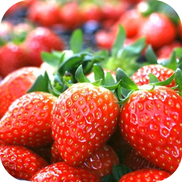

 

## 백엔드 공부 중 ✨
<!--</img>--!>

안녕하세요 이시현입니다.  
현재 백엔드를 공부하고 있습니다.  

<!--## Hi there 
### Hi there 👋
#### Hi there 👋
##### Hi there 👋

**sihyeon1020/sihyeon1020** is a ✨ _special_ ✨ repository because its `README.md` (this file) appears on your GitHub profile.

Here are some ideas to get you started:

- 🔭 I’m currently working on ...
- 🌱 I’m currently learning ...
- 👯 I’m looking to collaborate on ...
- 🤔 I’m looking for help with ...
- 💬 Ask me about ...
- 📫 How to reach me: ...
- 😄 Pronouns: ...
- ⚡ Fun fact: ...

**두껍게**  
*이탤릭*  
~~스트라이크~~  

[네이버](http://www.naver.com)

😏--!>

